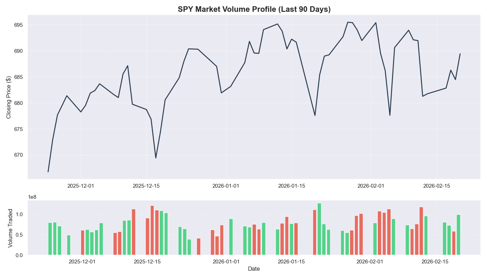
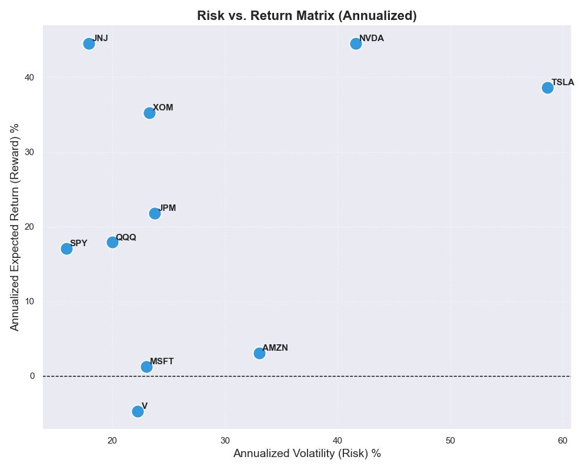
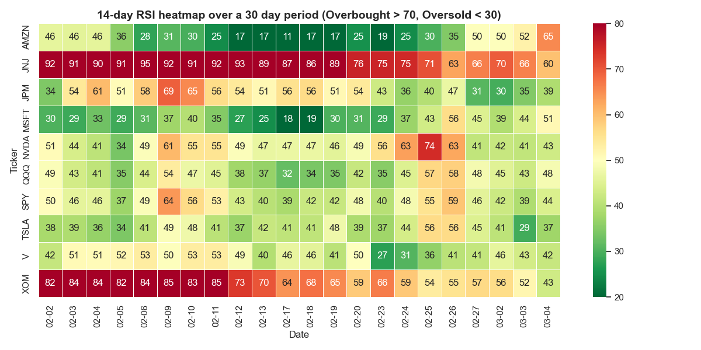
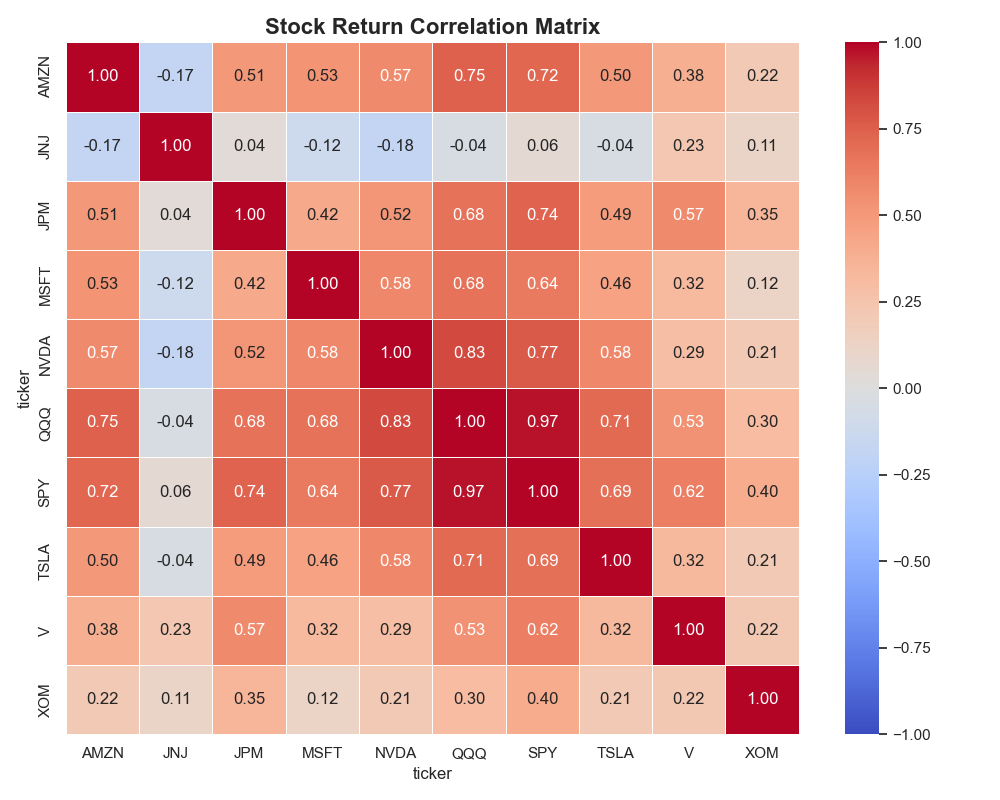

#  End-to-End Stock Market ETL & Analytics Pipeline


## Project Overview
An automated, production-ready ETL (Extract, Transform, Load) pipeline that fetches daily market data, calculates key technical indicators, loads the data into a relational database, and generates institutional-grade visualizations. 

I built this pipeline to automate quantitative analysis for a broader equity portfolio. Instead of manually scanning charts, this pipeline automatically flags overbought/oversold conditions, visualizes true capital flow (Dollar Volume), and maps the annualized risk-adjusted returns of target assets.

## 🏗️ Pipeline Architecture

The pipeline is orchestrated by a master `run_pipeline.py` script featuring automated logging, executing the following workflow:

1. **Extract (`extract.py`)**: Pulls the last 365 days of historical price and volume data for 10 target tickers via the Yahoo Finance API.
2. **Transform (`transform.py`)**: Cleans the data, handles missing values, and engineers new features using Pandas:
   * Daily Percentage Returns
   * 20-day and 50-day Simple Moving Averages (SMA)
   * 14-day Relative Strength Index (RSI)
   * 20-day Rolling Volatility
3. **Load (`load.py`)**: Inserts the transformed data into a local `SQLite` database (`stock_data.db`) using an Upsert (`INSERT OR REPLACE`) strategy to prevent duplication.
4. **Analyze (`analysis.py` & `query.py`)**: Executes complex SQL queries to screen for setups and generates automated Matplotlib/Seaborn visualizations.

## Analytical Output & Visualizations

The pipeline automatically renders the following reports:

### 1. Directional Market Volume Profile
*Visualizes true institutional capital flow by mapping price action directly over colour-coded daily volume (Green = Positive Return, Red = Negative Return) using a market proxy (SPY).*


### 2. Risk vs. Return Matrix
*Applies standard quantitative finance formulas (252 trading days) to map annualized portfolio volatility against expected returns, allowing for instant risk-adjusted performance screening.*


### 3. Momentum Screener (14-Day RSI)
*A dynamic heatmap identifying overbought (>70) and oversold (<30) market conditions across the portfolio.*


### 4. 90-Day Price Action Trends
*This baseline line chart maps the raw closing prices of all target equities over a medium-term (90-day) horizon. It provides a macro-level view of general market direction and individual asset momentum, allowing for quick visual identification of sustained uptrends, consolidations, or heavy sell-offs leading into current market conditions.*


### 5. 30-Day Portfolio Performance
*This bar chart isolates short-term relative strength by calculating the cumulative percentage return for each ticker over the trailing 30 days. By implementing dynamic colour-coding (green for positive returns, red for negative) and sorting the assets by performance, this visual acts as an instant momentum screener. It allows a portfolio manager to immediately identify which equities are currently leading or lagging the broader market.*


### 6. Asset Correlation Matrix
*This heatmap calculates the Pearson correlation coefficient between the daily returns of all assets in the portfolio. It is a critical quantitative tool for risk management and diversification. By visualizing how closely different stocks move together (where 1.0 represents perfect positive correlation), a portfolio manager can instantly identify redundant risk exposure (e.g., highly correlated tech equities moving in lockstep) or discover truly uncorrelated assets to hedge against sector-wide drawdowns.*


## 🖥️ Interactive Streamlit Dashboard

To make the data accessible to stakeholders and portfolio managers, this project includes a fully interactive web application (`dashboard.py`) built with Streamlit. The dashboard queries the local SQLite database in real-time, translating the raw backend ETL data into an intuitive quantitative terminal.

**Key Dashboard Features:**
* **Live KPI Metrics:** Dynamic cards calculating the latest closing prices and daily percentage returns for selected assets.
* **Interactive Controls:** A customizable sidebar allowing users to filter the entire dashboard by specific tickers and custom date ranges.
* **Custom Period Performance:** A reactive bar chart that instantly recalculates the total percentage return for selected assets based on the user-defined lookback period.
* **Isolated Volume Profiling:** A dedicated asset selector that renders a dual-pane chart, stacking price action directly over directional volume to isolate institutional capital flow.
* **Dynamic Advanced Analytics:** The Asset Correlation Matrix and Annualized Risk vs. Return scatter plots automatically recalculate and redraw themselves based on the current sidebar filters.

##  Advanced SQL Implementation
Beyond Python transformations, the database is queried using advanced SQL techniques to track market performance. Example from `query.py` utilizing **Common Table Expressions (CTEs)** and **Window Functions**:

```sql
WITH MonthlyPerformance AS (
    SELECT
        strftime('%Y-%m', date) as month,  
        ticker,
        SUM(daily_return) * 100 as monthly_return_pct
    FROM stock_data
    GROUP BY month, ticker
),
RankedPerformers AS (                      
    SELECT 
        month,
        ticker,
        monthly_return_pct,
        ROW_NUMBER() OVER(PARTITION BY month ORDER BY monthly_return_pct DESC) as win_rank,
        ROW_NUMBER() OVER(PARTITION BY month ORDER BY monthly_return_pct ASC) as lose_rank
    FROM MonthlyPerformance
)
SELECT 
    month,
    MAX(CASE WHEN win_rank = 1 THEN ticker END) as biggest_winner,
    MAX(CASE WHEN lose_rank = 1 THEN ticker END) AS biggest_loser
FROM RankedPerformers
GROUP BY month
ORDER BY month DESC;


##  How to Run
**1. Clone the repository**
```bash
git clone [https://github.com/Jemz-14/stock-etl-pipeline.git](https://github.com/Jemz-14/stock-etl-pipeline.git)
cd stock-etl-pipeline

**2. Install dependencies**
```bash
pip install -r requirements.txt

**3. Execute Pipeline
```bash
python run_pipeline.py

### 🖥️ 4. Launch the Interactive Dashboard

Once the database is populated by the ETL pipeline, you can spin up the interactive frontend terminal locally.

Run this command in your terminal:
```bash
streamlit run dashboard.py

(Note for Windows / Git Bash users: If the streamlit command is not recognized in your path, use Python's module execution instead:)
```bash
python -m streamlit run dashboard.py

The application will automatically launch in your default web browser at "http://localhost:8501"
